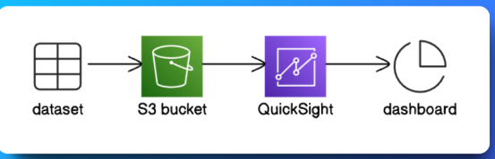
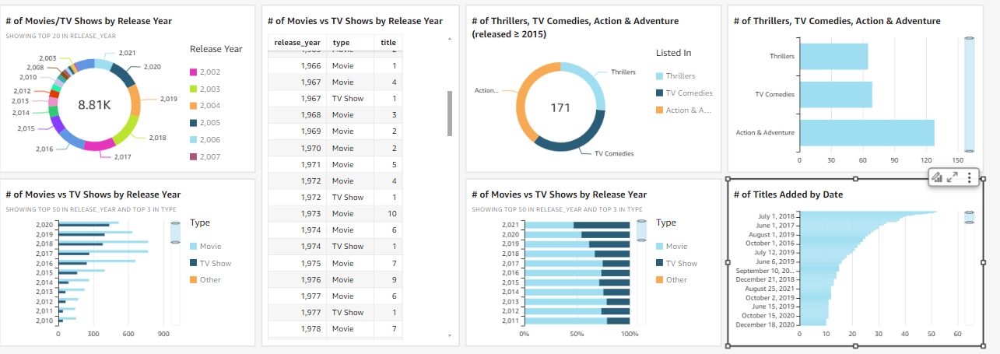

# Netflix Data Analysis with Amazon QuickSight

## Project Overview
This project demonstrates how I used **Amazon QuickSight** for the first time to analyze Netflix's content trends. The dataset was uploaded to **Amazon S3**, and QuickSight was utilized to create meaningful visualizations showcasing trends in TV shows and movies.

---
## Architectural design



---
## Project Structure
```
project-directory/
├── data/
│   ├── netflix_titles.csv        # The dataset containing Netflix content details
│   ├── manifest.json             # Manifest file specifying the dataset's S3 location and format
├── images/
│   ├── QuickSight_Visualization  # Visualization of content trends by release year
└── README.md                     
```

---

## Steps to Recreate the Project

### 0. **Create a QuickSight Account**
- Visit [Amazon QuickSight](https://quicksight.aws.amazon.com/).
- Sign up for an account (a free trial is available).
- Follow the setup instructions to get started with QuickSight.

### 1. **Set Up the Dataset**
- Upload the `netflix_titles.csv` file to an **Amazon S3 bucket**.
- Create a `manifest.json` file to specify the file location and format. Ensure you update the bucket name in the file to match your S3 bucket. Include:
  - File path in S3 (`s3://your-bucket-name/netflix_titles.csv`)
  - File format as `CSV`, with delimiter `,` and text qualifier `"`.

### 2. **Connect S3 to QuickSight**
- Visit the **Datasets** page in QuickSight under **Manage Data**.
- Select **New Dataset** and choose **S3** as the data source.
- Upload the `manifest.json` file to connect the S3 bucket to QuickSight.

### 3. **Create Visualizations**

Before starting, ensure you are logged into your **Amazon QuickSight account**. All visualizations will be created within your QuickSight workspace. Follow these steps to build meaningful insights from your dataset:
- **Visualization 1: Breakdown by Release Year**  
  Drag the `release_year` field into the Y-Axis and configure a donut chart to show the breakdown of content by year.

- **Visualization 2: TV Shows vs. Movies**  
  Add the `release_year` field to the X-Axis and `type` to Group/Color, comparing the count of TV shows vs. movies over time.

- **Visualization 3: Movies and TV shows per release year in a table**  
  Change your visual type to `Table`, then add `release_year` as your Group By label. Add `title` as your Value metric. Add the type label as a dimension.

- **Visualization 4: TV shows and movies with the listing released on 2015 or after**  
  Select the Filter icon and add a `release_year` filter. Make sure only the years `2015` and over are selected, then select Apply. 

- **Visualization 5: Breakdown by Release Year**  
  Use instructions for creating visualization and change the graph type to a Horizontal stacked 100% bar chart.

- **Visualization 6: TV shows listed as Action & Adventure, TV Comedies and Thrillers**  
  Click on the created filter, Deselect the Select all checkbox, then select these three tags:
  - Action & Adventure
  - Thrillers
  - TV Comedies
  Click `Apply` 

- **Visualization 7: Titles added by date**  
  Move the date_added label to both the Y Axis and Value headings.

### 4. **Customize and Export**
- Edit chart titles and add descriptive labels for clarity.
- Publish the dashboard and export it as a PDF.

---
##  Visual Dashboard



---
## Key Learnings
- Amazon QuickSight's drag-and-drop interface made it easy to create visualizations as a first-time user.
- Filters were essential for narrowing down data and focusing on specific insights.
- The process of connecting S3 and configuring datasets required careful attention to detail but was highly rewarding.

---

## Future Improvements
- Add more dimensions to the analysis, such as genres or countries.
- Automate dataset updates in S3 for real-time analysis.
- Explore embedding QuickSight dashboards in web applications.

---

## Resources
- [Amazon QuickSight Documentation](https://docs.aws.amazon.com/quicksight/)
- [AWS S3 Documentation](https://docs.aws.amazon.com/s3/)

Feel free to contribute or share feedback!
